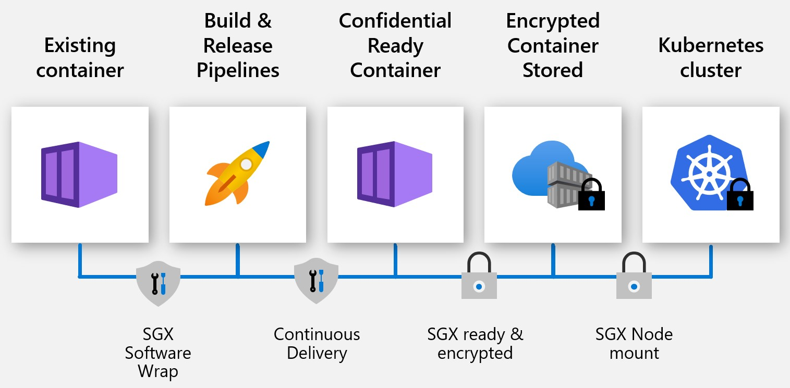
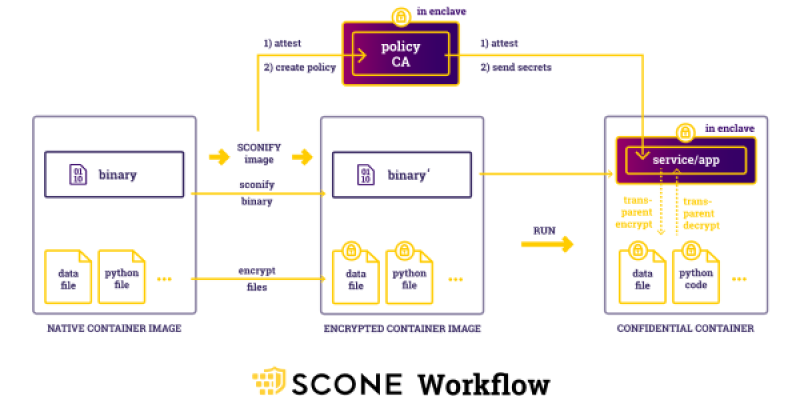
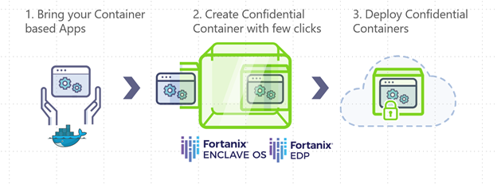

# Confidential Containers

Enabled developers to bring an existing docker application (new or existing) applications and run it securely on AKS through confidential computing nodes support.

Executions of confidential container application in secure enclaves provide:

1. data integrity 
1. data confidentiality
1. code integrity
1. container code protection
1. hardware-based assurances
1. create hardware root of trust

A hardware based Trusted Execution Environment (TEE) is an important component that is used to provide strong assurances through hardware and software measurements from Trusted computing case(TCB) components. Verifications of these measurement help with validation of the expected computation and verify any tampering of the container apps.

Confidential containers support customer applications developed with Python, Java, Node JS so on or packaged software applications like NGINX, Redis Cache, MemCache so on to be run unmodified on AKS.

Confidential containers are the fastest path to hardware based container confidentiality and aligned to cloud agnostic deployments. Confidential containers protected the code in the container through encryption while enabling fastest path to confidentiality with no/minimal changes to your business logic.

## Confidential Container Enablers

To run an existing docker container application an abstraction layer or SGX software is required. The software enables the functionality for the container application to directly execute the process to CPU thus removing the middle execution layers.

Confidential containers are fully supported on AKS and enabled through Azure Partners and Open Source Software (OSS) projects. Developers can choose software providers based on the features.

### Partner Enablers

#### SCONE

[SCONE](https://scontain.com/index.html?lang=en) supports security policies that can generate certificates, keys and secrets and ensures that these are only visible to attested services of an application.
In this way, the services of an application automatically attest each other via TLS - without the need to modify the applications nor TLS. This is explained with the help of a simple
Flask application here: https://sconedocs.github.io/flask_demo/  

SCONE can convert existing binaries into applications that run inside of enclaves without needing to change the application nor to recompile that application. SCONE also protects interpreted languages like Python by encrypting both data files as well as Python code files. With the help of a SCONE security policy one can protects the encrypted files against unauthorized accesses, modifications and rollbacks. How to „sconify" an existing Python application is explained [here](https://sconedocs.github.io/sconify_image/)

Scone deployments on confidential computing nodes with AKS are fully supported and integrated. Get started with a sample application here https://sconedocs.github.io/aks/

#### Fortanix

With [Fortanix](https://www.fortanix.com/) users can easily change your existing containerized applications to Confidential Containers with a click of a button without any application modifications or recompilation.  You can use Enclave Manager SaaS portal or our REST APIs to create Confidential Containers. Following user guide has detail instructions on creating a Confidential Container image for a containerized application using Fortanix Enclave Manager portal. [Get started](https://support.fortanix.com/hc/en-us/sections/360008910732-Quickstart) with quick deployment guide and standard docker container to [confidential container conversion](https://support.fortanix.com/hc/en-us/articles/360043529411-User-s-Guide-Create-an-Image).

#### Anjuna

[Anjuna](https://www.anjuna.io/) provides SGX platform software that enables you to run unmodified containers on AKS. Read more on the functionality and the user flow [here](https://www.anjuna.io/microsoft-azure-confidential-computing-aks-lp).

Get started with a sample Redis Cache and Python Custom Application [here](https://www.anjuna.io/microsoft-azure-confidential-computing-aks-lp)

### OSS Enablers 

#### Graphene

[Graphene](https://grapheneproject.io/) is a lightweight guest OS, designed to run a single Linux application with minimal host requirements. Graphene can run applications in an isolated environment with benefits comparable to running a complete OS and has good tooling support for converting existing docker container application to Graphene Shielded Containers (GSC).

Get started with a sample application and deployment on AKS [here](https://graphene.readthedocs.io/en/latest/cloud-deployment.html#azure-kubernetes-service-aks)

#### Occlum

[Occlum](https://occlum.io/) is a memory-safe, multi-process library OS (LibOS) for Intel SGX. It enables legacy applications to run on SGX with little to no modifications to source code. Occlum transparently protects the confidentiality of user workloads while allowing an easy lift and shift to existing docker applications.

Occlum supports AKS deployments. Follow the deployment instructions with various sample apps [here](https://github.com/occlum/occlum/blob/master/docs/azure_aks_deployment_guide.md)

#### Confidential Inferencing ONNX Runtime
Open source enclave-based ONNX runtime establishes a secure channel between the client and the inference service - ensuring the neither the request nor the response can leave the secure enclave. 

This solution allows you to bring existing ML trained model and run them confidentially while providing trust between the client and server through attestation and verifications. 

Get started with ML model lift and shift to ONNX runtime [here](https://aka.ms/confidentialinference)

## Confidential Containers Demo
View the confidential healthcare demo with confidential containers. 

> [!VIDEO https://www.youtube.com/embed/rT6zMOoLEqI]

## Get In Touch
> Have questions with your implementation or want to become an enabler? please reach out to acconaks@microsoft.com

<!-- LINKS - external -->
[Azure Attestation]: https://docs.microsoft.com/en-us/azure/attestation/

<!-- LINKS - internal -->
[DC Virtual Machine]: /confidential-computing/virtual-machine-solutions
