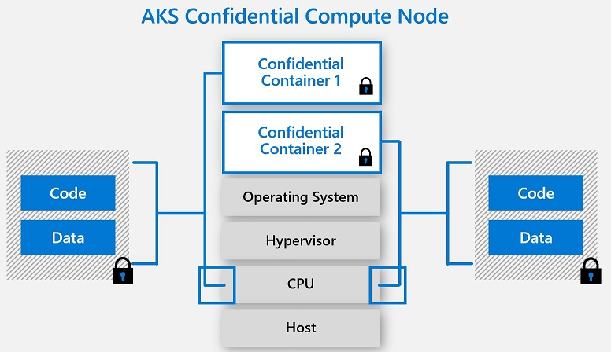

# Confidential Computing nodes on Azure Kubernetes Service (public preview)

Azure confidential computing allows you to protect your sensitive data while it's in use from other applications, administrators and providers. AKS supports creation of DCSv2 confidential computing nodes to run the sensitive workloads within a hardware based Trusted Execution Environment (TEE). The confidential worker nodes leverage Intel SGX to create isolated execution environment between each containers that directly happens from the application  to the CPU leverage by leveraging the special instruction sets that are made available through the SGX capability. For more information on available SGX enabled confidential computing VMs, [https://docs.microsoft.com/en-us/azure/virtual-machines/dcv2-series](see DCSv2 VM sizes in Azure).

## Features

1. Hardware based and process level container isolation through SGX trusted execution environment (TEE) 
1. Heterogenous node pool clusters (mix confidential node pools with non-confidential node pools)
1. Encrypted Page Cache (EPC) memory based pod scheduling
1. SGX DCAP driver pre-installed
1. Intel FSGS Patch pre-installed
1. CPU consumption based horizontal pod scaling and cluster auto-scaling
1. Intel Platform Software management daemon sets to help ith attestation needs
1. Linux Containers support on a Gen 2 Ubuntu 18.04 worker nodes
1. Supports currently GA'ed regions of DCSv2  

### Container Isolation

SGX enabled computing nodes have container level isolation when running an enclave. Each container has an hardware backed dedicated trusted execution environment (TEE)

 // Douglas On this.

### Device Plugin Daemon Set

SGX Device Plugin helps to make Kubernetes clusters aware of Intel SGX hardware, and to facilitate proper scheduling of SGX-dependent containers.

The SGX device plugin is deployed automatically when a new AKS Node is provisioned with DCSv2 SKU. This device plugin advertises `kubernetes.azure.com/sgx_epc_mem_in_MiB` resource to Kubernetes and keeps track of the requests. This helps Kubernetes to schedule applications that expose EPC memory (SGX powered DCSv2) also help with node selectors to only deploy on DCv2-Series nodes.

### Quote Helper Daemon Set

Any enclave application that performs remote attestation requires to generate QUOTE which provides a cryptographically proof of the identity and the state of the application as well as the environment the enclave is running. The generation of the QUOTE requires trusted software components from Intel which are part of the Platform Software Components (PSW/DCAP)

### SGX Driver & Base Image Configuration
SGX DCAP Driver version 1.33
Intel FSGS Kernel Patch
Azure Ubuntu Gen2 18.04

### Regions & Availability

All DC SKU's and regions are supported.

## Programming & application models

### Enclave aware containers

Application that are programmed to run on confidential nodes that leverage the SDK's and frameworks that are designed to provide most control to your applications. Applications developed and packaged as containers leveraging the below

1. Open Enclave (OE) SDK​
2. Intel SGX SDK​
3. Enarx SDK​
4. Confidential Consortium Framework (CCF)​
5. Edgeless RT

### Confidential Containers

Supports existing unmodified containers to be run on a confidential computing node with little to no changes to the existing business logic.

[Read more](confidential-containers.md)

## FAQ

### Performance

### Current AKS Features Supported

Enclaves are secured portions of a hardware’s processor and memory. There's no way to view data or code inside the enclave, even with a debugger. If untrusted code attempts modify the content in enclave memory, the environment gets disabled and the operations are denied.

When developing applications, you can use [software tools](#oe-sdk) to shield portions of your code and data inside the enclave. These tools will ensure your code and data can't be viewed or modified by anyone outside the trusted environment. 

Fundamentally, think of an enclave as a secured box. You put encrypted code and data in the box. From the outside of the box, you can't see anything. You give the enclave a key to decrypt the data, the data is then processed and encrypted again, before being sent out of the enclave.

### Attestation

You'll want to get verification and validation that your trusted environment is secure. This verification is the process of attestation. 

Attestation allows a relying party to have increased confidence that their software is (1) running in an enclave and (2) that the enclave is up to date and secure. For example, an enclave asks the underlying hardware to generate a credential that includes proof that the enclave exists on the platform. The report can then be given to a second enclave that verifies the report was generated on the same platform.

Attestation must be implemented using a secure attestation service that is compatible with the system software and silicon. [Intel's attestation and provisioning services](https://software.intel.com/sgx/attestation-services) are compatible with Azure confidential computing virtual machines.

Today, Azure offers the [DCsv2-Series](https://docs.microsoft.com/azure/virtual-machines/dcv2-series) built on Intel SGX technology for hardware-based enclave creation. You can build secure enclave-based applications to run in the DCsv2-series of VMs to protect your application data and code in use. 

You can [read more](virtual-machine-solutions.md) about deploying Azure confidential computing virtual machines with hardware-based trusted enclaves.

## Getting Started

[Provision Confidential Nodes (DCsv2-Series) on AKS](confidential-nodes-aks-getstarted.md)

[Quick starter samples](https://github.com/Azure-Samples)

[DCsv2 SKU List](https://docs.microsoft.com/en-us/azure/virtual-machines/dcv2-series)

<!-- LINKS - external -->
[Azure Attestation]: https://docs.microsoft.com/en-us/azure/attestation/

<!-- LINKS - internal -->
[DC Virtual Machine]: /confidential-computing/virtual-machine-solutions